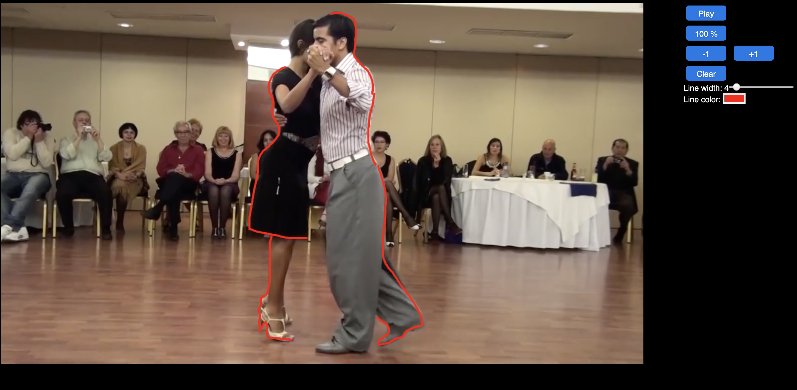

# VideoDoodle

Simple web application to make doodles on a video

VideoDoodle is a web application so it works locally inside your browser using any operative systems

## Installation

Download the repository in your home directory

Save a video inside the directory __video__ then open the file __index.html__ with your Web browser. 

Drag and drop a video file on the web page and draw

## Screenshot

